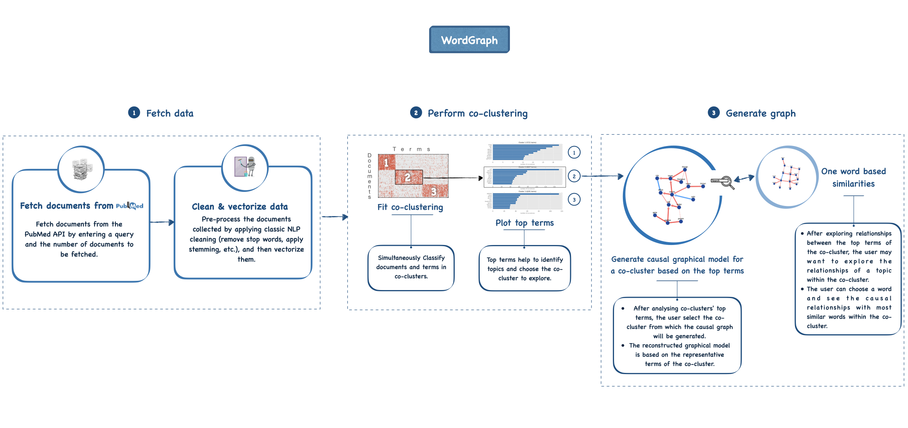
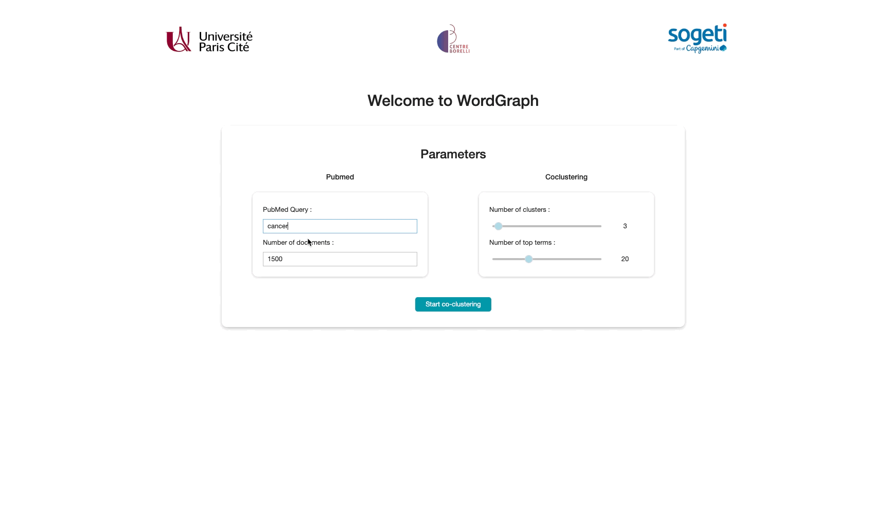

<div align="center"><h1> WordGraph: a python package for reconstructing interactive causal graphical models from text data</h1></div>

WordGraph is a python package for reconstructing interactive causal graphical models from large text data. The data is fetched directly from the [PubMed API](https://www.ncbi.nlm.nih.gov/home/develop/api/) through a search query.

The image below illustrates the overall workflow of WordGraph.




## Usage 
WordGraph comes with 3 levels of usage that are described below.
### **1. Simple usage:** 
The core functionalities of the package are grouped into 4 modules (Cf. [Package architecture](#package-architecture)): io, utils, wordGraph and visualization. The main functionnalities are : fetch data from pubmed, clean and vectorize data, perform co-clustering, plot clusters' top terms, generate graph from [MIIC - R library](#core-modules) (embedded inside wordGraph), and display interactive graphs. 

Here is an example of WordGraph simple usage (also available in the notebook `WordGraph simple usage.ipynb`) :
```python
from wordGraph.wordGraph import WordGraph
from wordGraph.io.pubmed_io import parse_pubmed_api
from wordGraph.visualization.viz_utils import plot_top_terms

# 1. Set the parameters
pm_query = 'cancer'; n_doc = 2500       # Corpus
n_clust = 3; n_terms = 10               # Co-clustering
g_shf = 100; g_thresh = 0.05            # MIIC
# 2. Fetch data from the PubMed API
raw_corpus,clean_corpus = parse_pubmed_api(pm_query,n_doc)
# 3. Fit the coclustering
wg = WordGraph()
wg.fit_coclusters(clean_corpus, n_clust)
plot_top_terms(wg, nb_terms=n_terms)
# 4. Build the words graph 
wg.set_cocluster(cocluster=3, nb_terms=n_terms)
wg.build_graph(n_shuffles=g_shf, conf_threshold=g_thresh)
```
The resulting object can either be displayed using wordGraph utils plot function or explored using built-in functions, for example :  
- Visualize and export collected documents.
- Explore graphs report summary.
- Export graph in [MIIC web server](https://miic.curie.fr/index.php) format.

```python
from wordGraph.visualization.viz_utils import plot_graph

# 1. Display interactive graphs
plot_graph(wg) 
# 2. Export collected documents in tf-idf vectorized format
wg.export_tfidf(tfidf_filename)
# 3. Explore graphs report summary
wg.graph['summary']
# 4. Export top terms representation in MIIC server format
wg.export_topTerms_MIIC(miic_filename)
```

### **2. Customizable notebook pipeline:**
A pre-built pipeline is proposed to easily use the main package functionalities. It is implemented using jupyter widgets and results in a single jupyter notebook cell embedding the whole pipeline. The implementation is available in the jupyter notebook `WordGraph Custom.ipynb`.</br>

 The pipeline can be easily personalized by : adding/removing widgets (slider, button, text or numerical inputs, etc.), changing default parameters, displaying more information from the resulting wordGraph object, etc.</br>
 We show below an example of the implementation of a button and corresponding on_click event function (function to be called when the button is clicked): 

```python
# Defining a 'Confirm' button with label 'Generate graph'
confirm = widgets.Button(description='Generate graph', disabled=False, button_style='success')
# Defining the function to be called on click
def on_confirm_button_clicked(button):
    button.disabled=True
    # Exp: Graph generation ../..
    button.disabled=False
# Binding the function to the button
confirm.on_click(on_confirm_button_clicked)
```


### **3. Web application:** 
A dashboard can be created from the `WordGraph Custom.ipynb` in a web application style using the package [voilà](#core-modules). The application is designed for users who are willing to use WordGraph and have no background in python nor jupyter notebook.

The dashboard can be used as a stand-alone application, ie. it can be deployed as a web application, or as a jupyter server extension to switch back and forth between the application and the jupyter notebook while personalizing the pipeline.

## Demo
The final WordGraph pipeline application is introduced below (a complete demonstration video of the package is provided at https://youtu.be/M6PtnZq64V4) :



## Package architecture

- **io:** 
    - parse_pubmed_api 
- **utils:** 
    - pre-processing
    - create_miic
    - preproc_graphML
- **wordGraph:** 
    - *class* WordGraph
        - fit_coclusters
        - set_cocluster
        - build_graph
        - export_document
        - export_tfidf
        - export_topTerms_MIIC
- **visualization:** 
    - plot_reorganized_mat
    - plot_top_terms
    - plot_graph

## Core modules
- [Coclust](https://coclust.readthedocs.io/en/v0.2.1/)
- [MIIC (R)](https://rdrr.io/cran/miic/man/miic.html)
- [ipycytoscape](https://ipycytoscape.readthedocs.io/en/latest/index.html)
- [Jupyter Widgets](https://ipywidgets.readthedocs.io/en/stable/)
- [Voilà](https://voila.readthedocs.io/en/stable/)
- [Bootstrap](https://getbootstrap.com/)
